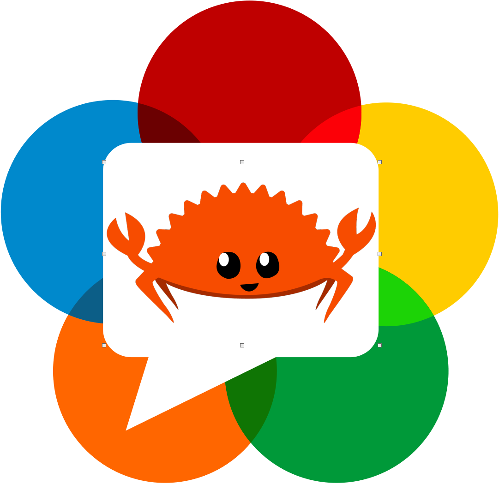

# WebRTC Tutorial in Rust+WASM !

<!--  -->
<h1 align="center">
 
 </h1>
 

#### Quick prerequisites
You will need to install `cargo-make` and `microserver`   
`cargo install --force cargo-make`  
`cargo install microserver`  

## Start Right away
You need two terminals opened in the root directory of the project.

From Terminal 1  
Terminal 1 🛠 : `cd ./wasm_client`  
Terminal 1 🛠 : `cargo make build` or `cargo make watch` (if you plan on tinkering)  
Terminal 1 🚀 : `cargo make serve`  

From Terminal 2:  
Terminal 2 🔌 : `cd ./signalling-server`  
Terminal 2 🔌 : `cargo make servesignal`  

⚠️ Don't forget to set your own ip address for your web-socket's signalling server inside `/wasm_client/src/websockets.rs`
  
This is to be read with the following [Medium Article](https://charles-schleich.medium.com/webrtc-video-chat-tutorial-using-rust-wasm-fa340f7aeef9).  

## Useful Terminology
- ICE : Interactive Connectivity Establishment
- SCTP : Stream Control Transmission Protocol (SCTP)
- SDP : Session Description Protocol
- STUN : Session Traversal Utilities for NAT
- NAT : Network Address Translation
- TURN : Traversal Using Relays around NAT

- Signaling: Signaling is the process of sending control information between two devices to determine the communication protocols, channels, media codecs and formats, and method of data transfer, as well as any required routing information. The most important thing to know about the signaling process for WebRTC: it is not defined in the specification. 
This is something that be implemented by the programmer, this project makes use of websockets to achieve this.

