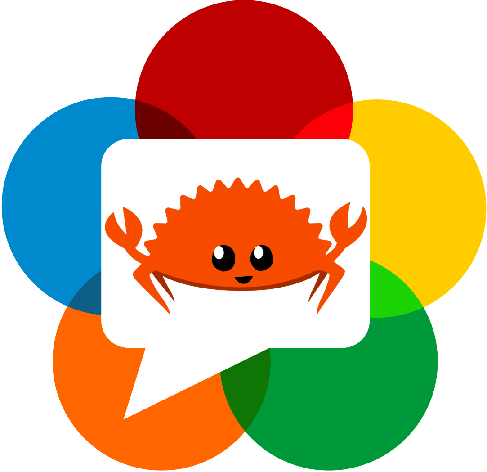

# WebRTC Tutorial in Rust+WASM !

#### Quick prerequisites
You will need to install `cargo make`   
`cargo install --force cargo-make`  

## Start Right away
To build the wasm, from `/wasm_client/` run  
Terminal 1 🛠 : `cargo make build` or `cargo make watch` (if you plan on tinkering)  

To run the servers (Can be done from root directory)  
Terminal 1 🚀 : `cargo make serve`  
Terminal 2 🔌 : `cargo make servesignal`  

! Don't forget to set your own ip address for your web-socket's signalling server inside `/wasm_client/src/websockets.rs`
  

## Useful Terminology
- ICE : Interactive Connectivity Establishment
- SCTP : Stream Control Transmission Protocol (SCTP)
- SDP : Session Description Protocol
- STUN : Session Traversal Utilities for NAT
- NAT : Network Address Translation
- TURN : Traversal Using Relays around NAT

- Signaling: Signaling is the process of sending control information between two devices to determine the communication protocols, channels, media codecs and formats, and method of data transfer, as well as any required routing information. The most important thing to know about the signaling process for WebRTC: it is not defined in the specification. 
This is something that be implemented by the programmer, this project makes use of websockets to achieve this.

This is to be read with the following [Medium Article](https://charles-schleich.medium.com/webrtc-video-chat-tutorial-using-rust-wasm-fa340f7aeef9).
